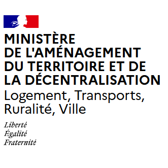
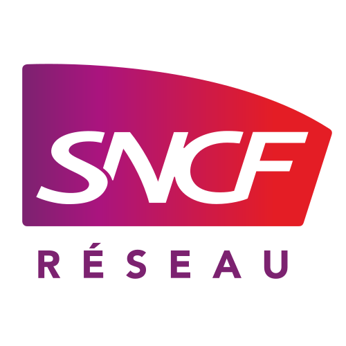

<p align="center">
  <a href="https://osrd.fr/en/">
    <picture>
      <source media="(prefers-color-scheme: dark)" srcset="/assets/branding/osrd_small_dark.svg">
      
    </picture>
  </a>
&nbsp;&nbsp;
  <a href="https://publiccode.eu/">
    
  </a>
</p>

<p align="center">
  <a href="https://osrd.fr/en/docs/guides/contribute/"></a>
  <a href="https://github.com/OpenRailAssociation/osrd/blob/dev/LICENSE"></a>
  <a href="https://github.com/OpenRailAssociation/osrd/actions/workflows/build.yml"></a>
  <a href="https://api.reuse.software/info/github.com/OpenRailAssociation/osrd"></a>
  <a href="https://github.com/OpenRailAssociation/technical-committee/blob/main/incubation-process.md"></a>
</p>

## What is OSRD?

OSRD (Open Source Railway Designer) is an open source web application for railway infrastructure design,
capacity analysis, timetabling and simulation and short term path request.

It's free and open-source forever!

Learn more about the project on [osrd.fr](https://osrd.fr/en/).

## Demo

Access the demo at [demo.osrd.fr](https://demo.osrd.fr).

> [!IMPORTANT]
> This environment is not intended for use in production. It is refreshed daily, and the data entered is accessible to everyone.

## ⚠️ Development status

OSRD is still in active development.
User and programming interfaces are not entirely stable and are still occasionally modified.
If you rely on OSRD, be prepared to deal with regular changes.

## Languages

OSRD support multiple languages. Here is the translation status for the different languages.
Integrated means that users can actually activate the language in the application.
If you want to contribute to the translation, you can do so easily with [Weblate](https://hosted.weblate.org/engage/osrd/).

| **Language**  |                                                          **Status**                                                         | **Integrated** |
|---------------|:---------------------------------------------------------------------------------------------------------------------------:|:--------------:|
| 🇬🇧 English       | [](https://hosted.weblate.org/engage/osrd/) |        ✅      |
| 🇫🇷 French        | [](https://hosted.weblate.org/engage/osrd/) |        ✅      |
| 🇩🇪 German        | [](https://hosted.weblate.org/engage/osrd/) |        ✅      |
| 🇵🇹 Portuguese    | [](https://hosted.weblate.org/engage/osrd/) |        ✅      |
| 🇪🇸 Spanish       | [](https://hosted.weblate.org/engage/osrd/) |        ❌      |

## Getting Started

To compile and run the application with an example infrastructure:

```sh
# build and run the entire stack
docker compose up -d --build

# import an small example infrastructure ("small_infra")
./scripts/load-railjson-infra.sh small_infra tests/data/infras/small_infra/infra.json

# import rolling stocks with realistic characterics, representative of the industry
./scripts/load-railjson-rolling-stock.sh tests/data/rolling_stocks/realistic/*.json --force

# import more rolling stocks
./scripts/load-railjson-rolling-stock.sh tests/data/rolling_stocks/*.json

# open the web app
xdg-open http://localhost:4000/
```

Linux or WSL users can use `./osrd-compose host` instead of `docker compose` to enable host networking: it can be useful to launch services in a debugger.

macOS users on Apple Silicon should make sure to set an arm64 image name for Postgres/PostGIS (to prevent slow amd64 emulation). This image name can be set by running `export OSRD_POSTGIS_IMAGE='nickblah/postgis:16-postgis-3'` before the first `docker compose` command.

The last-minute train (STDCM) module needs additional setup: start by creating a scenario, copy its ID from its URL, then run:

```sh
docker compose exec editoast editoast stdcm-search-env set-from-scenario <id>
```

If you need to use speed limits tags and loading gauge, run this:

```sh
echo '{ "LG1": [], "LG2": [] }' > /tmp/allowed_tracks.json
docker cp /tmp/allowed_tracks.json osrd-editoast:/tmp/
docker compose exec editoast editoast stdcm-search-env set-from-scenario <id> --speed-limit-tags "CC100|100" "CC90|90" "CC200|200" --default-speed-limit-tag "CC100" /tmp/allowed_tracks.json
```

## Working on a single component

Each component has a _justfile_ to run usual development tasks. Install [just](https://github.com/casey/just#installation) and run it to see available recipes. All the components include:

* run
* install
* test
* format
* lint
* fix-lint

## Deployment

To deploy the application on a server, check out the [deployment guide](https://osrd.fr/en/docs/guides/deploy/).

## Get in touch

Send an email at <contact@osrd.fr>, [open an issue](https://github.com/OpenRailAssociation/osrd/issues/new?labels=kind%3Aquestion&template=question.yaml), or join the [#public-general:osrd.fr](https://matrix.to/#/#public-general:osrd.fr) matrix channel.

## Sponsors

<p align="center">
  
  
  
</p>

## License

OSRD is licensed under the GNU Lesser General Public License v3.0, see LICENSE.

Copyright © 2022 The OSRD Contributors
