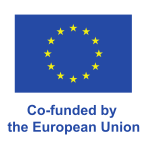

<p align="center">
  <a href="https://osrd.fr/en/">
    <picture>
      <source media="(prefers-color-scheme: dark)" srcset="/assets/branding/osrd_small_dark.svg">
      
    </picture>
  </a>
&nbsp;&nbsp;
  <a href="https://publiccode.eu/">
    
  </a>
</p>

<p align="center">
  <a href="https://osrd.fr/en/docs/guides/contribute/"></a>
  <a href="https://github.com/OpenRailAssociation/osrd/blob/dev/LICENSE"></a>
  <a href="https://github.com/OpenRailAssociation/osrd/actions/workflows/build.yml"></a>
</p>

## What is OSRD?

OSRD is an open source web application for railway infrastructure design,
capacity analysis, timetabling and simulation.

It's free and open-source forever!

Learn more about the project on [osrd.fr](https://osrd.fr/en/).

## WARNING

OSRD it not yet production ready.
User and programming interfaces can and will change (now is the time to make suggestions!).
Important features are missing. Documentation is sparse.
Please don't rely on OSRD unless you are prepared to deal with frequent changes.

## Getting Started

To compile and run the application with an example infrastructure:

```sh
# build and run the entire stack
docker compose up -d --build

./scripts/load-railjson-infra.sh small_infra tests/data/infras/small_infra/infra.json
./scripts/load-railjson-rolling-stock.sh tests/data/rolling_stocks/fast_rolling_stock.json

# open the web app
xdg-open http://localhost:4000/
```

(Linux users can use `docker-compose-host.yml` to enable host networking)

## Get in touch

- Chat with us on IRC at [libera.chat#osrd](https://web.libera.chat/#osrd)
- Email us at <contact@osrd.fr>

## Sponsors

<p align="center">
  
  
  
</p>
