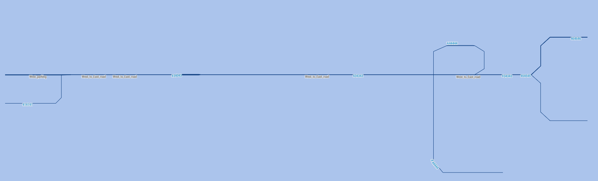
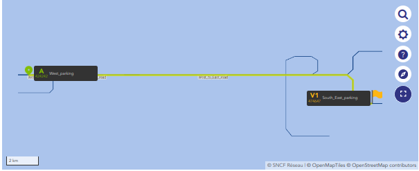

# Integration tests

### Run the tests

To run tests `poetry run pytest` after starting docker containers (`docker compose up` at the root of the project) and installing dependencies (`poetry install`, see [poetry doc](https://python-poetry.org/docs/)).

To run a list of specific tests, run `poetry run pytest -k test_name_1 test_name_2 ...`.

To setup end-to-end (e2e) tests, please see [front readme](../front/README.md#npm-run-e2e-tests).

### Create new integration tests

To add a test, follow [pytest doc](https://docs.pytest.org/).
Available fixtures are defined in `conftest.py`.

## Fixture details

### `small_infra`

`small_infra` fixture is creating this infra in the database:

### `west_to_south_east_path`

`west_to_south_east_path` is a path on small infra from _west parking_ to _south east parking_

# Fuzzer

The fuzzer is a script that generates random tests and logs any error that occurred.
Run `poetry run python3 fuzzer/fuzzer.py`, any error will be reported in `fuzzer/errors` in a json.

Note: you need a docker running locally _with at least one infra imported_.
It can be a generated infra, or it can be imported from some other DB.

If the test is run on a generated infra, the json containing the error report
can be copied to `tests/regression_tests_data/` to integrate it into the test suite.

### Non-public test data

Some bugs can't be reproducible on public infrastructures. Regression tests generated by the fuzzer
on a private infra can't be integrated in the public test suite, but it can still be convenient to run them from pytest.

Any repository can be cloned in `regression_test_data` to add extra tests, the json files will be detected recursively.
